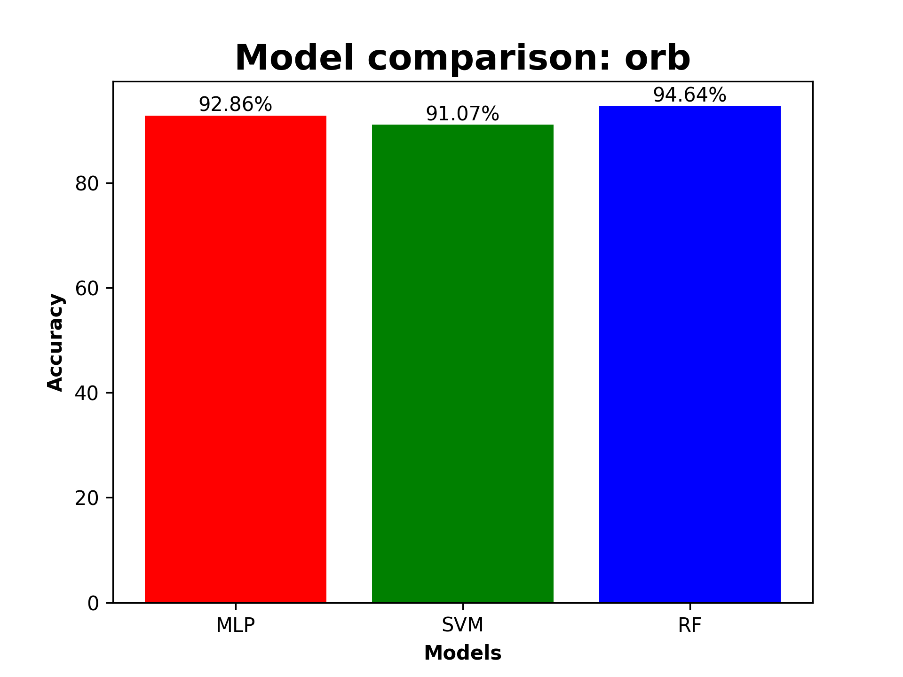
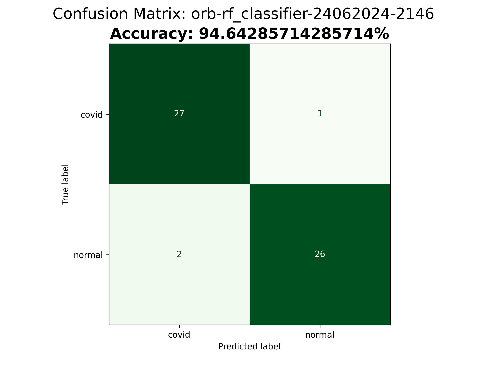
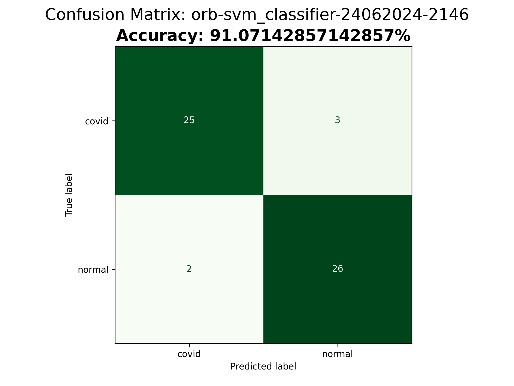
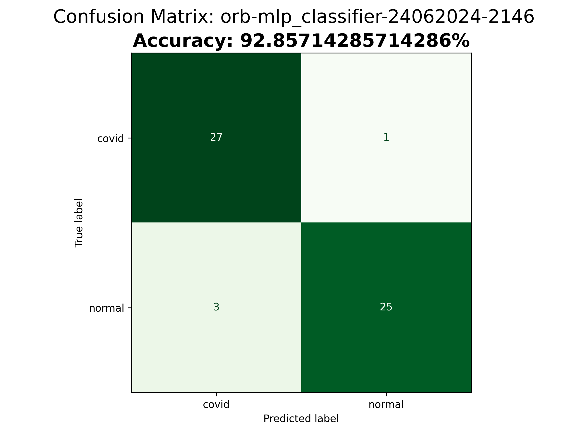

# Projeto de Classificação de Imagens

## Equipe
- 2319195   [João Pedro Flausino de Lima](https://github.com/joaozin046)
- 2411342   [Arthur Henrique Abrantes Hassimyan](https://github.com/ArthurHassimyan)

## Descrição dos Descritores Implementados
### ORB Feature Extraction
O descritor `orb_FeatureExtraction.py` extrai características das imagens usando o algoritmo ORB (Oriented FAST and Rotated BRIEF), que é utilizado para detectar e descrever pontos chave em imagens de forma eficiente.    
1.**Detecção de Pontos Chave com FAST:**
- FAST é um algoritmo usado para encontrar cantos em uma imagem.
- Ele examina um círculo de pixels ao redor de um pixel central para ver se ele é um canto.
- O pixel central é considerado um canto se vários pixels no círculo ao seu redor forem consistentemente mais claros ou mais escuros do que o pixel central.
- O ORB melhora o FAST usando uma técnica chamada Harris Corner Measure para escolher os cantos mais importantes.

2.**Descrição de Pontos Chave com BRIEF:**
- BRIEF é um método para descrever a área ao redor de cada ponto chave usando uma sequência de comparações simples.
- Ele escolhe pares de pixels aleatoriamente ao redor do ponto chave e compara seus valores de intensidade.
- O resultado dessas comparações é uma sequência de bits (0s e 1s) que descreve a área ao redor do ponto chave.
- O ORB ajusta o BRIEF para que ele funcione bem mesmo se a imagem estiver rotacionada. Ele faz isso calculando o ângulo do ponto chave e girando a área ao redor desse ponto antes de aplicar o BRIEF.


Link do repositório do projeto: [link_do_repositorio](https://github.com/joaozin046/Trabalho_Final_Processamento_de_imagens.git)

## Classificador e Acurácia
### Classificadores Utilizados
- `mlp_classifier.py`: Classificador utilizando Perceptron Multicamadas (MLP).
- `rf_classifier.py`: Classificador utilizando Random Forest.
- `svm_classifier.py`: Classificador utilizando Máquinas de Vetores de Suporte (SVM).

### Acurácias Obtidas
- **MLP Classifier**: 92.86%
- **Random Forest Classifier**: 94.64%
- **SVM Classifier**: 91.07%

## Instruções de Uso
1. **Clone o repositório**:
   ```bash
   git clone https://github.com/seu_usuario/seu_projeto.git
   cd seu_projeto
   
2. **Instale as dependências**:
   ```python
    pip install -r requirements.txt
  
3. **Execute o extrator de características**:
   ```python
   python featureExtractors/orb_FeatureExtraction.py
  
  
4.**Execute os classificadores**:

- **MLP Classifier**:
   ```python
   python classifiers/mlp_classifier.py
   

- **Random Forest Classifier**:
   ```python
   python classifiers/mlp_classifier.py
   

- **SVM Classifier:**:
   ```python
   python classifiers/mlp_classifier.py
   

## Resultados
 Os resultados dos classificadores estão armazenados na pasta results.
***
Accuracy | Random Forest (RF)
--- | ---
 | 
Support Vector Machine (SVM) | Multilayer Perceptron (MLP)
|
